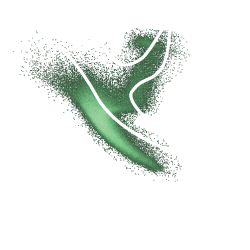

  

**NEST-web** (**N**eural network **E**stimator of **S**tellar **T**imes) is a Javascript implementation of the [NEST python package](https://github.com/star-age/NEST) designed to make the use of pre-trained neural networks for stellar age estimation easy.

It is based on the upcoming paper Boin et al. 2025.

With it, you can estimate the ages of stars based on their position in the Color-Magnitude Diagram and their metallicity. It contains a suite of Neural Networks trained on different stellar evolutionary grids. If observational uncertainties are provided, it can compute age uncertainties.

This repository includes the code for the website, the weights and biases of the pretrained neural networks (`/models`), and isochrone curve files (`/isochrones`).
